# Agentic Workflow Architecture

## System Overview

Agentic Workflow is a portable AI-agent toolkit optimized for ChatGPT Codex and Claude Code with three independent components: 34 custom skills spanning the full development lifecycle (planning, design, review, debugging, QA, shipping, retrospectives), a documentation bootstrapper skill, a TypeScript MCP bridge server for inter-agent coordination, and a centralized output directory for cross-skill artifact sharing. The skills are installed by symlinking into agent homes (`~/.claude/skills/` and/or `~/.codex/skills/`) and invoked as slash commands inside supported AI client sessions. The MCP bridge runs as either a stdio MCP server (registered with `claude mcp add` or `codex mcp add`) or a standalone Fastify REST API, persisting messages and tasks to a local SQLite database so agents can exchange context asynchronously.

```mermaid
graph TD
    subgraph "AI Client Session — Planning"
        User --> |"/officeHours"| OfficeHours[officeHours skill]
        User --> |"/productReview"| ProductReview[productReview skill]
        User --> |"/archReview"| ArchReview[archReview skill]
    end

    subgraph "AI Client Session — Review"
        User --> |"/review 42"| Review[review skill]
        User --> |"/postReview"| PostReview[postReview skill]
        User --> |"/addressReview"| AddressReview[addressReview skill]
    end

    subgraph "AI Client Session — QA & Debug"
        User --> |"/rootCause"| RootCause[rootCause skill]
        User --> |"/bugHunt"| BugHunt[bugHunt skill]
        User --> |"/bugReport"| BugReport[bugReport skill]
    end

    subgraph "AI Client Session — Ship & Retro"
        User --> |"/shipRelease"| ShipRelease[shipRelease skill]
        User --> |"/syncDocs"| SyncDocs[syncDocs skill]
        User --> |"/weeklyRetro"| WeeklyRetro[weeklyRetro skill]
    end

    subgraph "AI Client Session — Utilities"
        User --> |"/enhancePrompt"| EnhancePrompt[enhancePrompt skill]
        User --> |"/bootstrap"| Bootstrap[bootstrap skill]
    end

    subgraph "AI Client Session — Design"
        User --> |"/design-analyze"| DesignAnalyze[design-analyze skill]
        User --> |"/design-language"| DesignLanguage[design-language skill]
        User --> |"/design-evolve"| DesignEvolve[design-evolve skill]
        User --> |"/design-mockup"| DesignMockup[design-mockup skill]
        User --> |"/design-implement"| DesignImplement[design-implement skill]
        User --> |"/design-refine"| DesignRefine[design-refine skill]
        User --> |"/design-verify"| DesignVerify[design-verify skill]
        DesignAnalyze --> DesignLanguage
        DesignEvolve --> DesignLanguage
        DesignEvolve --> DesignAnalyze
        DesignLanguage --> DesignMockup
        DesignMockup --> DesignImplement
        DesignImplement --> DesignRefine
        DesignRefine --> DesignVerify
    end

    Review --> |"gh pr diff"| GitHub
    Review --> |"Agent tool"| Triage[Triage Subagent]
    Triage --> Reviewers[Parallel Reviewer Subagents]

    OfficeHours --> OutputDir
    ProductReview --> OutputDir
    ArchReview --> OutputDir
    Reviewers --> OutputDir
    RootCause --> OutputDir
    BugHunt --> OutputDir
    BugReport --> OutputDir
    ShipRelease --> OutputDir
    SyncDocs --> OutputDir
    WeeklyRetro --> OutputDir

    OutputDir["~/.agentic-workflow/repo-slug/"]

    PostReview --> |"gh api"| GitHub
    AddressReview --> |"Agent tool"| Implementers[Parallel Implementer Subagents]
    Implementers --> |"git push"| GitHub
    ShipRelease --> |"gh pr create"| GitHub

    subgraph "MCP Bridge"
        MCP[mcp.ts — stdio] --> Services[Application Services]
        REST[index.ts — Fastify :3100] --> Services
        Services --> SQLite[(bridge.db)]
    end

    Review -.-> |"send_context / assign_task"| MCP
```



### Skill Pipeline

Skills are designed to flow into each other in a natural development lifecycle:

```
officeHours → productReview / archReview
    → design-analyze [web|ios] → design-language → design-mockup [web|ios] → design-implement [web|ios] → design-refine → design-verify [web|ios]
    → review → rootCause → bugHunt → shipRelease → syncDocs → weeklyRetro
```

Each skill writes outputs to `~/.agentic-workflow/<repo-slug>/` that downstream skills auto-discover.

## Directory Tree

```
agentic-workflow/
├── skills/                              # Portable AI client slash-command skills (34)
│   ├── review/                          # /review — multi-agent PR review orchestrator
│   │   ├── SKILL.md                     #   skill manifest + 7-step orchestration flow
│   │   ├── triage-prompt.md             #   subagent prompt: classify files → reviewer agents
│   │   └── reviewer-prompt.md           #   subagent prompt: domain-specific code review
│   ├── postReview/                      # /postReview — publish findings to GitHub
│   │   └── SKILL.md                     #   reads review state, posts batched PR reviews
│   ├── addressReview/                   # /addressReview — implement review fixes
│   │   ├── SKILL.md                     #   orchestrator: triage → parallel implementers
│   │   ├── address-triage-prompt.md     #   subagent prompt: group issues → impl agents
│   │   └── implementer-prompt.md        #   subagent prompt: fix code, commit, reply
│   ├── enhancePrompt/                   # /enhancePrompt — context-aware prompt rewriter
│   │   └── SKILL.md                     #   discovers docs, enriches user prompt
│   ├── rootCause/                       # /rootCause — 4-phase systematic debugging
│   │   └── SKILL.md                     #   investigate → analyze → hypothesize → implement
│   ├── bugHunt/                         # /bugHunt — fix-and-verify loop
│   │   └── SKILL.md                     #   3 tiers, atomic commits, regression tests
│   ├── bugReport/                       # /bugReport — read-only health audit
│   │   └── SKILL.md                     #   health scores, bug classification, no fixes
│   ├── shipRelease/                     # /shipRelease — sync, test, push, PR
│   │   └── SKILL.md                     #   pre-flight → sync → test → push → PR → syncDocs
│   ├── syncDocs/                        # /syncDocs — post-ship doc updater
│   │   └── SKILL.md                     #   README, ARCHITECTURE, CHANGELOG, CLAUDE.md, and rule directories
│   ├── weeklyRetro/                     # /weeklyRetro — weekly retrospective
│   │   └── SKILL.md                     #   per-person breakdown, shipping streaks, insights
│   ├── officeHours/                     # /officeHours — YC-style brainstorming
│   │   └── SKILL.md                     #   6 forcing questions → design doc
│   ├── productReview/                   # /productReview — founder/product lens review
│   │   └── SKILL.md                     #   4 modes: mvp, growth, scale, pivot
│   ├── archReview/                      # /archReview — engineering architecture review
│   │   └── SKILL.md                     #   mandatory diagrams, edge case analysis
│   ├── design-analyze/                  # /design-analyze — platform dispatcher (routes to -web or -ios)
│   ├── design-analyze-web/              # /design-analyze web — extract design tokens from web reference sites
│   ├── design-analyze-ios/              # /design-analyze ios — extract design tokens from iOS reference apps
│   ├── design-language/                 # /design-language — define brand personality and aesthetic direction
│   ├── design-evolve/                   # /design-evolve — platform dispatcher (routes to -web or -ios)
│   ├── design-evolve-web/               # /design-evolve web — merge new web reference into existing design language
│   ├── design-evolve-ios/               # /design-evolve ios — merge new iOS reference into existing design language
│   ├── design-mockup/                   # /design-mockup — platform dispatcher (routes to -web or -ios)
│   ├── design-mockup-web/               # /design-mockup web — generate HTML mockup using design language
│   ├── design-mockup-ios/               # /design-mockup ios — generate SwiftUI mockup using design language
│   ├── design-implement/                # /design-implement — platform dispatcher (routes to -web or -ios)
│   ├── design-implement-web/            # /design-implement web — generate React/Next.js production code from mockup
│   ├── design-implement-ios/            # /design-implement ios — generate SwiftUI production code from mockup
│   ├── design-refine/                   # /design-refine — dispatch Impeccable refinement commands
│   ├── design-verify/                   # /design-verify — platform dispatcher (routes to -web or -ios)
│   ├── design-verify-web/               # /design-verify web — screenshot diff web implementation vs mockup
│   ├── design-verify-ios/               # /design-verify ios — screenshot diff iOS implementation vs mockup
│   ├── verify-app/                      # /verify-app — platform dispatcher (routes to verify-web or verify-ios)
│   ├── verify-web/                      # /verify-web — standalone web app verification using Playwright
│   ├── verify-ios/                      # /verify-ios — standalone iOS app verification using XcodeBuildMCP
│   ├── _preamble.md                     # Shared preamble reference (not a skill)
│   ├── _design-preamble.md              # Shared design context preamble (not a skill)
│   └── _shared/
│       └── skill-lock.sh               # Shared lock script sourced by platform sub-skills to prevent concurrent runs
├── bootstrap/                           # /bootstrap — repo documentation generator
│   └── SKILL.md                         #   audits 17 Pivot-pattern docs, generates missing
├── config/                              # AI client configuration archive
│   ├── settings.json                    #   model, plugins, permissions, statusLine command, PreToolUse + SessionStart hook registrations
│   ├── statusline.sh                    #   adaptive two-line statusline (5 tiers: FULL/MEDIUM/NARROW/COMPACT/COMPACT-S)
│   ├── mcp.json                         #   MCP server registrations (xcodebuildmcp)
│   └── hooks/                           #   Safety hook scripts installed to ~/.claude/hooks/
│       ├── block-destructive.sh         #     PreToolUse — blocks rm -rf, git reset --hard, git push --force, etc.
│       ├── block-push-main.sh           #     PreToolUse — blocks git push to main/master
│       ├── detect-secrets.sh            #     PreToolUse — blocks AWS keys, GitHub tokens, Bearer tokens
│       ├── rtk-rewrite.sh              #     PreToolUse — rewrites eligible bash commands to rtk equivalents for token compression (runs 4th)
│       ├── git-context.sh              #     SessionStart — injects current branch, recent commits, working tree status
│       └── bridge-context.sh           #     SessionStart — silent no-op (memory graph layer removed; exits 0 if bridge unreachable or endpoint missing)
├── mcp-bridge/                          # TypeScript MCP bridge server
│   ├── package.json                     #   Node >=20, Fastify 5, better-sqlite3, Zod 3
│   ├── tsconfig.json                    #   ES2022, Node16 modules, strict mode
│   ├── vitest.config.ts                 #   Vitest config — v8 coverage, no thresholds, excludes index.ts + mcp.ts
│   ├── tests/                           #   Unit and integration tests (99 tests)
│   │   ├── routes/                      #     Route integration tests via Fastify inject (messages, tasks, conversations)
│   │   ├── client.test.ts               #     DbClient unit tests
│   │   ├── schema.test.ts               #     Migration and schema tests
│   │   ├── message-controller.test.ts   #     Message controller unit tests
│   │   ├── task-controller.test.ts      #     Task controller unit tests
│   │   ├── conversation-controller.test.ts #  Conversation controller unit tests
│   │   ├── mcp-tools.test.ts            #     MCP tool handler tests (resultToContent validation)
│   │   ├── services.test.ts             #     Application service unit tests
│   │   ├── server-errors.test.ts        #     Server error handling tests
│   │   ├── result.test.ts               #     AppResult utility tests
│   │   ├── types.test.ts               #     Transport type tests
│   │   └── helpers.ts                   #     Shared test helpers: createTestBridgeDb
│   └── src/
│       ├── index.ts                     #   REST entry point — binds Fastify on :3100
│       ├── mcp.ts                       #   MCP entry point — stdio transport, 5 tools
│       ├── server.ts                    #   Fastify factory — registers routes, Zod validation
│       ├── db/
│       │   ├── schema.ts               #   SQLite migrations (messages + tasks tables, WAL)
│       │   └── client.ts               #   DbClient interface — prepared statements, transactions
│       ├── application/
│       │   ├── result.ts               #   AppResult<T> discriminated union (ok/err, never throws)
│       │   └── services/
│       │       ├── send-context.ts     #   Insert a "context" message into a conversation
│       │       ├── get-messages.ts     #   Fetch by conversation; fetch unread + mark-read (atomic)
│       │       ├── get-conversations.ts #   Get paginated conversation summaries
│       │       ├── assign-task.ts      #   Insert task + notification message (transactional)
│       │       └── report-status.ts    #   Insert status message + update task (transactional)
│       ├── transport/
│       │   ├── types.ts               #   RouteSchema, ApiRequest<T>, ApiResponse<T>, defineRoute()
│       │   ├── schemas/
│       │   │   ├── common.ts          #   Shared Zod schemas: IdParams, ConversationParams, RecipientQuery
│       │   │   ├── message-schemas.ts #   SendContext, GetMessages, GetUnread request/response schemas
│       │   │   ├── task-schemas.ts    #   AssignTask, GetTask, GetTasksByConversation, ReportStatus schemas
│       │   │   └── conversation-schemas.ts  #   Zod schemas for conversation list request/response
│       │   └── controllers/
│       │       ├── message-controller.ts      #   Delegates to message services, maps AppResult → ApiResponse
│       │       ├── task-controller.ts         #   Delegates to task services, maps AppResult → ApiResponse
│       │       └── conversation-controller.ts #   Delegates to conversation service, maps AppResult → ApiResponse
│       └── routes/
│           ├── messages.ts            #   POST /messages/send, GET /messages/conversation/:id, GET /messages/unread
│           ├── tasks.ts               #   POST /tasks/assign, GET /tasks/:id, GET /tasks/conversation/:id, POST /tasks/report
│           └── conversations.ts       #   GET /conversations (paginated summaries)
├── scripts/                             # Utility scripts
│   └── serena-docker                    #   Serena MCP wrapper — mounts repo into Docker at invocation time
├── Dockerfile.serena                    # Serena base image (TS, Python, Go, Rust)
├── Dockerfile.serena-csharp             # Serena C# extension image (adds OmniSharp + .NET SDK)
├── .serena/                             # Serena LSP per-repo configuration
│   └── project.yml                      #   Language servers, ignored_paths, read_only flag
├── .claude/
│   ├── rules/                           # Glob-scoped domain rules (Claude client)
│   │   ├── bridge-services.md           #   AppResult pattern, MCP tools, service contracts
│   │   ├── bridge-transport.md          #   Typed router, controller factories, Zod schema conventions
│   │   ├── database.md                  #   DbClient, schema reference, idempotency
│   │   ├── design.md                    #   Design pipeline, artifact formats, design principles
│   │   ├── hooks.md                     #   Hook protocols, PreToolUse/SessionStart patterns, adding new hooks
│   │   ├── mcp-servers.md               #   MCP server usage guide (Serena vs Grep/Read decision table)
│   │   ├── skills.md                    #   Skill structure, preamble format, repo slug, output dirs
│   │   └── testing.md                   #   Test infrastructure, shared helpers, coverage policy
│   └── settings.json                    #   disableBypassPermissionsMode, enabledMcpjsonServers
├── .codex/
│   └── rules -> ../.claude/rules       # Codex rule mirror (symlink)
├── .dockerignore                        # Excludes node_modules, dist, *.db from Docker build context
├── setup.sh                             # One-command installer: skills, config, statusline, hooks, Serena Docker images, MCP registration
├── .gitignore                           # Ignores node_modules, dist, *.db, .env, .review-cache
└── README.md                            # Project overview, setup instructions, env vars
```

### Centralized Output Directory

```
~/.agentic-workflow/<repo-slug>/
├── design/           # /design-mockup, /design-verify baselines and diffs
├── reviews/          # /review, /postReview, /addressReview state files
├── investigations/   # /rootCause investigation reports
├── qa/               # /bugHunt and /bugReport reports
├── plans/            # /officeHours, /productReview, /archReview design docs
├── releases/         # /shipRelease and /syncDocs reports
└── retros/           # /weeklyRetro retrospectives
```

The repo slug is derived from `git remote get-url origin` (e.g., `org-name-repo-name`), falling back to the directory name. This directory persists across sessions and branches, enabling cross-skill artifact discovery.

## Component 1: Skills (skills/, bootstrap/)

### Overview

Thirty-four portable AI client skills defined as Markdown SKILL.md files with YAML frontmatter. Skills are slash commands that the AI client executes as structured workflows. They use the `Agent` tool to spawn parallel subagents and `gh` CLI for GitHub API access. Every skill includes a shared preamble that lists all 34 skills, points to the centralized output directory, and checks bootstrap status. Seven design pipeline skills (design-analyze, design-language, design-evolve, design-mockup, design-implement, design-refine, design-verify) share a separate design preamble for brand context and design token management. Six of the skills (design-analyze, design-evolve, design-mockup, design-implement, design-verify, and verify-app) are thin platform dispatchers: they **auto-detect** the platform by checking for iOS indicators (Package.swift, *.xcodeproj) or web indicators (package.json with a web framework dependency) and route to the appropriate sub-skill automatically. When detection is ambiguous, the dispatcher asks the user to clarify. Manual sub-skill invocation (e.g., `/design-mockup-web`, `/design-mockup-ios`) is available as an escape hatch. The shared utility `skills/_shared/skill-lock.sh` is sourced by all dispatcher sub-skills to prevent concurrent platform invocations from the same repo.

### Review Pipeline (skills/review/, postReview/, addressReview/)

A three-phase PR review workflow with a shared state file (`~/.agentic-workflow/<repo-slug>/reviews/{number}.json`) as the coordination mechanism:

**Phase 1 — `/review`:** Fetches PR diff and metadata via `gh`, spawns a triage subagent to classify changed files into domain-specific reviewer assignments (from a catalog of 12+ specialist agents like `security-sentinel`, `kieran-typescript-reviewer`, `performance-oracle`). Triage includes SQL safety checks and LLM trust boundary analysis. All reviewers run in parallel via the `Agent` tool. Each returns structured JSON with severity-tagged issues (`blocking`, `issue`, `suggestion`, `nit`) including `diff_position` for inline placement. Results are written to the reviews directory.

**Phase 2 — `/postReview`:** Reads the state file and publishes findings to GitHub as batched PR reviews (one `gh api` call per reviewer agent). Captures posted comment IDs back into the state file. Marks `posted: true`.

**Phase 3 — `/addressReview`:** Reads the state file, fetches any new human comments from GitHub since `reviewed_at`, runs an address-triage subagent to group all unresolved issues by implementation concern, then spawns parallel implementer subagents. Implementers fix code, commit, push, and reply to every comment. The state file is updated with `addressed: true` and commit SHAs. Can be re-run iteratively.

### Investigation & QA (skills/rootCause/, bugHunt/, bugReport/)

**`/rootCause`** — 4-phase systematic debugging: investigate (reproduce), analyze (read source, map call chain), hypothesize (rank 2-3 causes), implement (fix and verify). Auto-freezes scope to the module boundary after analysis to prevent scope creep. Writes investigation report to `investigations/`.

**`/bugHunt`** — Fix-and-verify loop with 3 tiers (quick: lint+typecheck, standard: unit+integration, exhaustive: full suite). Makes atomic commits for fixes and regression tests. Retries up to 3 times on verification failure. Writes QA report to `qa/`.

**`/bugReport`** — Read-only health audit. Runs linters, typecheckers, and test suites, classifying findings as bug/tech-debt/test-gap/false-positive. Computes health scores (test 40%, type 30%, lint 30%). Never modifies source code. Writes audit report to `qa/`.

### Release & Retro (skills/shipRelease/, syncDocs/, weeklyRetro/)

**`/shipRelease`** — Pre-flight checks (clean tree, branch exists), fetch and rebase on base, run tests, audit coverage, push, open PR via `gh`, then auto-invoke `/syncDocs`. Writes release report to `releases/`.

**`/syncDocs`** — Post-ship documentation updater. Spawns parallel agents to update README, ARCHITECTURE.md, CHANGELOG, CLAUDE.md, and rule files (`.claude/rules/`, `.codex/rules/`) with targeted edits based on recent git changes. Commits updates. Writes sync report to `releases/`.

**`/weeklyRetro`** — Analyzes git history for per-person breakdowns (commits, lines, areas of activity), shipping streaks, test health trends, and generates actionable insights. Compares to previous retros if available. Writes retrospective to `retros/`.

### Planning (skills/officeHours/, productReview/, archReview/)

**`/officeHours`** — YC-style brainstorming with 6 forcing questions (problem, user, current state, unfair advantage, smallest version, success metrics). Outputs a structured design doc to `plans/`.

**`/productReview`** — Founder/product lens review with 4 scope modes: MVP (cut scope), Growth (growth levers, retention), Scale (operational bottlenecks, unit economics), Pivot (what to kill, adjacent opportunities). Delivers SHIP/ITERATE/RETHINK verdict. Writes to `plans/`.

**`/archReview`** — Engineering architecture review with mandatory mermaid diagrams (component, data flow, sequence). Edge case analysis at every component boundary. Scores complexity, scalability, maintainability (1-10). Delivers SOUND/NEEDS WORK/REDESIGN verdict. Writes to `plans/`.

### Design Pipeline (skills/design-*)

A seventeen-skill pipeline for extracting brand identity from reference sites and generating pixel-accurate UI implementations for web and iOS. Design artifacts are written to `~/.agentic-workflow/<repo-slug>/design/`. Five of the skills are platform dispatchers that route to web or iOS sub-skills based on the first argument.

**`/design-analyze [web|ios]`** — Dispatcher that routes to `design-analyze-web` or `design-analyze-ios`. The web variant runs the Dembrandt CLI against reference URLs to extract design tokens (colors, typography, spacing, motion) into `design-tokens.json` in W3C DTCG format. The iOS variant inspects reference iOS apps via XcodeBuildMCP.

**`/design-language`** — Interactive session that synthesizes token analysis into a brand personality document. Asks forcing questions about tone, target audience, and aesthetic direction, then writes `.impeccable.md` with the brand context and updates `planning/DESIGN_SYSTEM.md` with the full component catalog and strategic decisions.

**`/design-evolve [web|ios]`** — Dispatcher that routes to `design-evolve-web` or `design-evolve-ios`. Merges a new reference into the existing design language, diffs against the current `design-tokens.json`, and updates `.impeccable.md` and `DESIGN_SYSTEM.md` without discarding prior decisions.

**`/design-mockup [web|ios]`** — Dispatcher that routes to `design-mockup-web` or `design-mockup-ios`. The web variant generates a self-contained HTML mockup; the iOS variant generates a SwiftUI mockup. Both write to `~/.agentic-workflow/<repo-slug>/design/` and serve as the pixel-accurate baseline for downstream verification.

**`/design-implement [web|ios]`** — Dispatcher that routes to `design-implement-web` or `design-implement-ios`. Generates production-quality code: React/Next.js with Tailwind for web, SwiftUI for iOS. Aligns component structure, spacing, and color usage to the design tokens.

**`/design-refine`** — Dispatches Impeccable refinement commands with the full design context injected. Used to iteratively tighten spacing, typography, and visual hierarchy in the implementation against the mockup baseline.

**`/design-verify [web|ios]`** — Dispatcher that routes to `design-verify-web` or `design-verify-ios`. Takes screenshots of both the mockup and the live implementation, performs a pixel diff, and writes a verification report to `design/`. Reports deviation percentage and highlights mismatched regions.

Pipeline: `design-analyze [web|ios] → design-language → design-mockup [web|ios] → design-implement [web|ios] → design-refine → design-verify [web|ios]` (`design-evolve [web|ios]` can run anytime to incorporate new references)

Design artifacts: `.impeccable.md` (brand context for AI tools), `design-tokens.json` (W3C DTCG token set), `planning/DESIGN_SYSTEM.md` (component catalog and strategic decisions).

### App Verification (skills/verify-app/, verify-web/, verify-ios/)

**`/verify-app`** — Thin platform dispatcher. Auto-detects the platform by checking for iOS indicators (Package.swift, *.xcodeproj) or web indicators (package.json with a web framework dependency) and routes to `verify-web` or `verify-ios` automatically. When detection is ambiguous, asks the user to clarify. Can be used anytime — it does not depend on the design pipeline.

**`/verify-web`** — Standalone web app verification. Uses Playwright to navigate the running web app, take screenshots, and verify UI behaviour against expected outcomes. Writes a verification report to `~/.agentic-workflow/<repo-slug>/verification/`.

**`/verify-ios`** — Standalone iOS app verification. Uses XcodeBuildMCP to launch the app on an iOS Simulator, capture `snapshot_ui` trees and screenshots, and verify screen state against expected outcomes. Supports a `--visual` flag to trigger pixel-level screenshot comparison. Writes a verification report to `~/.agentic-workflow/<repo-slug>/verification/`.

### Prompt Enhancer (skills/enhancePrompt/)

A utility skill that discovers project documentation files (CLAUDE.md, planning/, docs/), reads those relevant to the user's current request, and rewrites the prompt with injected context before execution. Used by `/bootstrap` as its first step.

### Bootstrap (bootstrap/)

Orchestrates generation of up to 17 Pivot-pattern planning documents (ARCHITECTURE, ERD, API_CONTRACT, TESTING, etc.) plus a trimmed CLAUDE.md (navigation doc only, under 80 lines), rule directories (`.claude/rules/` and `.codex/rules/`) inferred from the repo's actual structure, and a `.serena/project.yml` config for Serena LSP integration. Audits existing coverage by searching for docs under flexible name patterns, then spawns batched `Agent` subagents (4-5 at a time) to research and write missing docs. Adapts content to the target repo's actual tech stack. Suggests relevant skills from the full 34-skill pipeline as next steps.

### Serena LSP Integration

Serena is a Dockerized LSP MCP server that provides symbol navigation (find definitions, usages, call hierarchy) for any repo. It is registered globally via `claude mcp add --scope user` or `codex mcp add` and is available in every Claude Code or Codex session. Prerequisite: Docker Desktop must be installed and running.

- **`scripts/serena-docker`** — Wrapper script that launches the Serena Docker container, mounting the repo root read-only with writable bind mounts for `.serena/cache`, `.serena/logs`, and `.serena/memory`. It accepts `SERENA_CONTEXT` / `SERENA_REPO_PATH` overrides, only mounts `.serena/project.yml` when the file exists, and auto-selects the C# image when that config declares `csharp`. Installed to `~/.local/bin/serena-docker` by `setup.sh`.
- **`.serena/project.yml`** — Per-repo config (language servers, `ignored_paths`, `read_only: true`). Generated by `/bootstrap` and committed to the repo. `ignored_paths` controls LSP indexing only — Serena's `read_file` tool is not constrained by it.
- **Rule files (`.claude/rules/` + `.codex/rules/`)** — Project-scoped guidance loaded by each client. Includes MCP server usage guidance and decision tables for when to use Serena vs Grep/Read.
- **Two-image strategy** — The base image (`serena-local:latest`) supports TypeScript, Python, Go, Rust, and most other languages. The C# extension image (`serena-local:latest-csharp`) adds OmniSharp and .NET SDK; it is auto-built by `setup.sh` when `.csproj`/`.cs` files are detected, or manually via `BUILD_CSHARP=1 ./setup.sh`.

## Component 2: MCP Bridge (mcp-bridge/)

### Overview

A TypeScript application providing two transport layers over the same business logic: a Fastify REST API (for HTTP clients) and an MCP stdio server (for AI client tool calls). Both transports share the same `DbClient` and application services. The bridge enables asynchronous message-passing between AI agents using a SQLite store-and-forward pattern.

### Layered Architecture

The bridge follows a strict three-layer architecture with unidirectional dependencies:

**Transport Layer** (`transport/`, `routes/`, `server.ts`) — Handles HTTP request parsing, Zod validation, and response formatting. The `defineRoute<TSchema>()` identity function captures the generic `TSchema` type parameter, linking Zod schemas to handler signatures at compile time. The Fastify server iterates over `ControllerDefinition[]` arrays, registering each route with automatic Zod validation of `params`, `query`, and `body`. POST routes return 201; errors map `statusHint` to HTTP status codes; `ZodError` maps to 400.

**Application Layer** (`application/`) — Pure functions that accept a `DbClient` and input, returning `AppResult<T>`. The `AppResult<T>` type is a discriminated union: `{ ok: true, data: T } | { ok: false, error: AppError }`. Services never throw. Multi-step operations (e.g., `assignTask` inserts both a task and a notification message) are wrapped in `db.transaction()` for atomicity.

**Data Layer** (`db/`) — `schema.ts` runs DDL migrations on startup (idempotent `CREATE TABLE IF NOT EXISTS`). `client.ts` exposes a `DbClient` interface with pre-compiled prepared statements. All IDs are UUIDs generated via `crypto.randomUUID()`. The database uses WAL journal mode for concurrent read performance.

### Data Model

**Bridge database (bridge.db)** — Two tables with conversation-based partitioning:

**messages** — `id` (UUID PK), `conversation` (UUID), `sender`, `recipient`, `kind` (enum: context | task | status | reply), `payload` (text), `meta_prompt` (nullable), `created_at`, `read_at` (nullable, set on retrieval). Indexed on `conversation` and `(recipient, read_at)`.

**tasks** — `id` (UUID PK), `conversation` (UUID), `domain`, `summary`, `details`, `analysis` (nullable), `assigned_to` (nullable), `status` (enum: pending | in_progress | completed | failed), `created_at`, `updated_at`. Indexed on `conversation` and `status`.


### MCP Tools (mcp.ts)

Five tools exposed over stdio transport:

| Tool | Description |
|------|-------------|
| `send_context` | Insert a message with kind=context into a conversation |
| `get_messages` | Retrieve full conversation history by UUID |
| `get_unread` | Fetch unread messages for a recipient, atomically marking them read |
| `assign_task` | Create a task + notification message in one transaction |
| `report_status` | Send a status message and optionally update task status |

### REST API (index.ts + server.ts)

Nine endpoints on Fastify (default `127.0.0.1:3100`):

| Method | Path | Handler |
|--------|------|---------|
| GET | `/health` | Health check (returns `{ status: "ok" }`) |
| POST | `/messages/send` | `sendContext` service |
| GET | `/messages/conversation/:conversation` | `getMessagesByConversation` service |
| GET | `/messages/unread?recipient=` | `getUnreadMessages` service |
| POST | `/tasks/assign` | `assignTask` service |
| GET | `/tasks/:id` | Direct `db.getTask()` lookup |
| GET | `/tasks/conversation/:conversation` | Direct `db.getTasksByConversation()` lookup |
| POST | `/tasks/report` | `reportStatus` service |
| GET | `/conversations?limit=&offset=` | `getConversations` service — paginated summaries |

The server refuses to bind to non-loopback addresses unless `ALLOW_REMOTE=1` is set, since the API has no authentication.

## Component 3: Config Archive (config/, .claude/, .codex/)

Archived AI client configuration for replication across machines:

- **config/settings.json** — Sets model to `opus`, enables plugins (github, superpowers, compound-engineering, swift-lsp, playwright), enables experimental agent teams flag, sets effort level to `high`.
- **config/mcp.json** — Registers the `xcodebuildmcp` MCP server (`npx -y xcodebuildmcp@2.3.0 mcp`) for iOS Simulator control.
- **`.claude/settings.json`** — Project-level settings: disables bypass-permissions mode (`"disable"` string, not boolean per Claude Code 1.x schema).
- **Rule directories (`.claude/rules/`, `.codex/rules/`)** — Glob-scoped rule files auto-loaded by each client when working on matching files. Detailed domain rules were moved out of the monolithic `CLAUDE.md` (now a slim navigation doc under 80 lines) into these files: `bridge-services.md`, `bridge-transport.md`, `database.md`, `design.md`, `hooks.md`, `mcp-servers.md`, `skills.md`, `testing.md`.

## Key Rules

1. **Skills are stateless Markdown.** Each skill is a SKILL.md with YAML frontmatter (`name`, `description`, `allowed-tools`, `disable-model-invocation`). The Markdown body is the prompt — the AI client executes it step-by-step. No runtime code, no build step.

2. **All skill outputs go to the centralized directory.** `~/.agentic-workflow/<repo-slug>/` is the persistent output directory shared across all skills. Subdirectories: `design/`, `reviews/`, `investigations/`, `qa/`, `plans/`, `releases/`, `retros/`. The repo slug is derived from `git remote get-url origin` or falls back to the directory name.

3. **Every skill includes the shared preamble.** The preamble lists all 34 skills, points to the output directory, and checks bootstrap status (skills symlinked, MCP bridge built, rule directories present (`.claude/rules/` or `.codex/rules/`)). If not bootstrapped, it prompts the user to run `setup.sh`. Design pipeline skills additionally include a design-specific preamble for brand context.

4. **Application services never throw.** Every service function returns `AppResult<T>` — a discriminated union of `ok(data)` or `err(AppError)`. Error propagation uses value returns, not exceptions. The transport layer maps `AppError.statusHint` to HTTP status codes.

5. **Type safety flows from Zod schemas through to handlers.** The `defineRoute<TSchema>()` generic captures the schema type, so `handler(req: ApiRequest<TSchema>)` gets fully inferred `params`, `query`, and `body` types. Schemas are defined once and shared between validation and type inference.

6. **Multi-step writes are transactional.** `assignTask` (task + message insert) and `reportStatus` (message + task update) wrap their operations in `db.transaction()`. `getUnreadMessages` atomically fetches and marks messages read.

7. **The bridge has no authentication.** The REST API binds to loopback only (`127.0.0.1`) by default and exits with an error if a non-loopback host is configured without `ALLOW_REMOTE=1`. This is a deliberate design choice for local-only multi-agent coordination.

8. **Subagents run in parallel via the Agent tool.** Both `/review` (reviewer subagents) and `/addressReview` (implementer subagents) spawn all agents simultaneously in a single message. Triage always runs sequentially first to determine the agent assignments.

9. **Setup is symlink-based.** `setup.sh` creates symlinks from `~/.claude/skills/` and/or `~/.codex/skills/` into this repo rather than copying files. Changes to skill definitions take effect immediately without re-running setup. Setup also creates the `~/.agentic-workflow/` base directory, builds the Serena Docker image(s), installs the `serena-docker` wrapper to `~/.local/bin/`, and registers Serena as a global MCP server via `claude mcp add --scope user` or `codex mcp add`.

10. **The MCP server and REST API share identical business logic.** `mcp.ts` calls the same service functions as the Fastify controllers. The only difference is transport: stdio with `resultToContent()` formatting vs. HTTP with `ApiResponse<T>` envelopes.

11. **SQLite is configured for concurrent access.** WAL journal mode is enabled on database creation, allowing multiple readers alongside a single writer — suitable for the bridge's pattern of multiple agents polling for unread messages.

12. **Zero telemetry.** No session tracking, no analytics logging, no external service calls. Skills do not phone home. All data stays local.

13. **`/* v8 ignore */` annotations are prohibited.** Write the test instead. The bridge uses Vitest with v8 coverage. Coverage thresholds are not enforced at the `vitest.config.ts` level. Entry points `src/index.ts` and `src/mcp.ts` are excluded from coverage.
