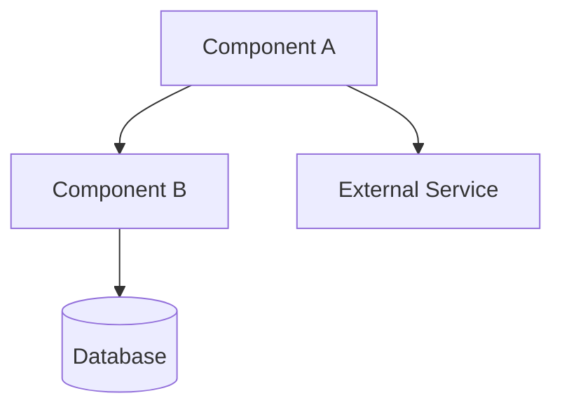
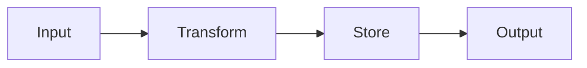
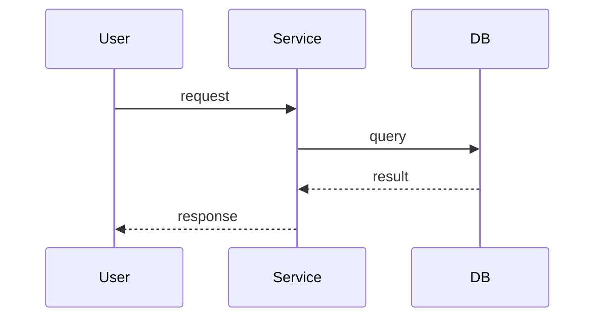

# Architecture Review — Engineering Lens

Reviews plans or implementations for technical soundness. Produces mandatory mermaid diagrams, edge case analysis, and a scored verdict.
## Shared Setup

Read [the shared Codex skill preamble](../_preamble.md) before proceeding.

## Step 1: Resolve the Target

**If a file path is given**, read that file as the plan/spec to review.

**If a directory is given**, explore its structure using Glob and Read to understand the implementation.

**If nothing is given**, try two fallbacks in order:
1. Find the most recent plan in `$HOME/.agentic-workflow/$REPO_SLUG/plans/`. Plans may be either a directory (new SDD format with `requirements.md`, `design.md`, `TASKS.md`) or a single `.md` file (legacy format). Check both and prefer whichever is newest:
   ```bash
   # Find newest plan directory (SDD format) and newest plan file (legacy format)
   NEWEST_DIR=$(ls -dt "$HOME/.agentic-workflow/$REPO_SLUG/plans/"*/ 2>/dev/null | head -1)
   NEWEST_FILE=$(ls -t "$HOME/.agentic-workflow/$REPO_SLUG/plans/"*.md 2>/dev/null | head -1)

   # Compare timestamps -- prefer whichever is more recent
   if [ -n "$NEWEST_DIR" ] && [ -n "$NEWEST_FILE" ]; then
     if [ "$NEWEST_DIR" -nt "$NEWEST_FILE" ]; then
       PLAN_TARGET="$NEWEST_DIR"
     else
       PLAN_TARGET="$NEWEST_FILE"
     fi
   elif [ -n "$NEWEST_DIR" ]; then
     PLAN_TARGET="$NEWEST_DIR"
   elif [ -n "$NEWEST_FILE" ]; then
     PLAN_TARGET="$NEWEST_FILE"
   fi
   ```
   If `PLAN_TARGET` is a directory, explore its structure using Glob and Read to review all three files (`requirements.md`, `design.md`, `TASKS.md`). If it is a single file, read it as before.
2. If no plans exist, review the current project's architecture by exploring the repository root.

## Step 2: Read Context

Read all available architectural context:

- `AGENTS.md` or `CLAUDE.md` — project conventions and structure
- `planning/ARCHITECTURE.md` or `ARCHITECTURE.md` — existing architecture docs
- `planning/ERD.md` or `ERD.md` — data model
- `planning/API_CONTRACT.md` or `API_CONTRACT.md` — API surface
- `README.md` — project overview

Use Glob to discover these files -- do not assume paths.

## Step 3: Architecture Analysis

If the user explicitly asked for delegated or parallel review help, spawn an explorer sub-agent to map the system. Otherwise, perform this exploration locally:

The agent should investigate and report on:

- **Component boundaries** — What are the distinct modules/services? Where are the boundaries drawn?
- **Dependency graph** — What depends on what? Are there circular dependencies?
- **Data flow paths** — How does data enter, transform, and exit the system?
- **External integrations** — What third-party services, APIs, or tools are involved?
- **State management** — Where is state stored? How is it synchronized? What is the source of truth?
- **Error propagation** — How do errors flow across boundaries? Are they handled or swallowed?

The agent should read source files, configuration, and package manifests to build an accurate picture.

## Step 4: Generate Mandatory Diagrams

Create three mermaid diagrams. These are **mandatory** -- the review is incomplete without them.

### 4a: Component Diagram

Show each module/service as a box with dependency arrows. Include:
- Internal components and their responsibilities
- External dependencies (databases, APIs, file system)
- Direction of dependency (who depends on whom)



### 4b: Data Flow Diagram

Show how data moves through the system from entry to exit:
- Input sources (user, API, file, event)
- Transformation steps
- Storage points
- Output destinations



### 4c: Sequence Diagram

Model the single most critical user flow end-to-end:
- All participants (user, services, databases)
- Request/response pairs
- Error paths for the main flow



## Step 5: Edge Case Analysis

For **each component boundary** identified in Step 3, analyze these four failure modes:

### 5a: Dependency Unavailable
- What happens when each external dependency is unreachable?
- Is there a timeout? A retry? A fallback?
- Does the failure cascade or is it contained?

### 5b: Invalid / Malicious Input
- What happens with unexpected types, missing fields, oversized payloads?
- Is input validated at the boundary or deep inside?
- Are there injection vectors (SQL, command, path traversal)?

### 5c: Load Stress (10x)
- What happens at 10x the expected request volume?
- Where is the first bottleneck (CPU, memory, I/O, connections)?
- Are there unbounded queues, caches, or buffers?

### 5d: State Leakage
- Can state from one request/user leak into another?
- Are there shared mutable globals?
- Is cleanup guaranteed (connections, file handles, temp files)?

## Step 5.5: Dark Factory Adversarial Stress Test (if enabled)

**Start the pipeline:**
```
mcp__prism-mcp__session_start_pipeline — project: REPO_SLUG,
  objective: "Adversarially challenge this architecture review of: {target description from Step 1}. Find: (1) failure modes not identified in the edge case analysis, (2) risks whose impact or likelihood is understated, (3) suggested improvements that are vague or insufficient ('add monitoring' is not a mitigation — what specifically?), (4) component boundaries where error propagation is unaddressed. For each finding, provide component:function or file:line evidence.",
  working_directory: "<absolute path to repo root>",
  max_iterations: 2
```

Store the returned `pipeline_id`. Poll until complete:
```
mcp__prism-mcp__session_check_pipeline_status — pipeline_id: <pipeline_id>
```

When complete:
- `COMPLETED` — no additional issues found beyond what the review already covers. Proceed to Step 6.
- `FAILED` — incorporate the evaluator's additional findings into the edge case analysis before writing the verdict. Surface them clearly in the Top Risks table.

## Step 6: Review Verdict

Produce the final assessment:

```markdown
# Architecture Review: {title}

_Reviewed by `archReview` on {ISO date}_

## Verdict: {SOUND | NEEDS WORK | REDESIGN}

{One paragraph justification}

## Scores

| Dimension | Score (1-10) | Notes |
|-----------|:---:|-------|
| Complexity | {n} | {brief justification} |
| Scalability | {n} | {brief justification} |
| Maintainability | {n} | {brief justification} |

## Component Diagram

{mermaid diagram from 4a}

## Data Flow Diagram

{mermaid diagram from 4b}

## Sequence Diagram

{mermaid diagram from 4c}

## Top Risks

| # | Risk | Impact | Likelihood | Mitigation |
|---|------|--------|------------|------------|
| 1 | {risk} | {high/med/low} | {high/med/low} | {recommendation} |
| 2 | {risk} | {high/med/low} | {high/med/low} | {recommendation} |
| ... | ... | ... | ... | ... |

## Edge Case Findings

### Dependency Failures
{findings from 5a}

### Input Validation Gaps
{findings from 5b}

### Load Concerns
{findings from 5c}

### State Leakage Risks
{findings from 5d}

## Missing Error Handling
- {specific location and what's missing}
- {specific location and what's missing}

## Suggested Improvements (Prioritized)

| Priority | Improvement | Effort | Impact |
|----------|------------|--------|--------|
| P0 | {must fix before shipping} | {S/M/L} | {description} |
| P1 | {should fix soon} | {S/M/L} | {description} |
| P2 | {nice to have} | {S/M/L} | {description} |
```

## Step 7: Write the Review

Generate a URL-safe slug from the target title (lowercase, hyphens, no special chars). Write the file:

```bash
TIMESTAMP=$(date +%Y%m%d-%H%M%S)
```

Write to: `$HOME/.agentic-workflow/$REPO_SLUG/plans/{timestamp}-arch-review-{slug}.md`

Include all three mermaid diagrams and the complete analysis.

## Step 8: Report

Show a summary to the user:

```
Architecture Review complete!

Verdict: {SOUND | NEEDS WORK | REDESIGN}

Scores:
  Complexity:      {n}/10
  Scalability:     {n}/10
  Maintainability: {n}/10

Review written to: ~/.agentic-workflow/{repo-slug}/plans/{timestamp}-arch-review-{slug}.md

Top 3 risks:
  1. {risk summary}
  2. {risk summary}
  3. {risk summary}

Suggested next steps:
  productReview — Get founder-lens feedback on the plan
  officeHours — Brainstorm solutions to identified risks
```
