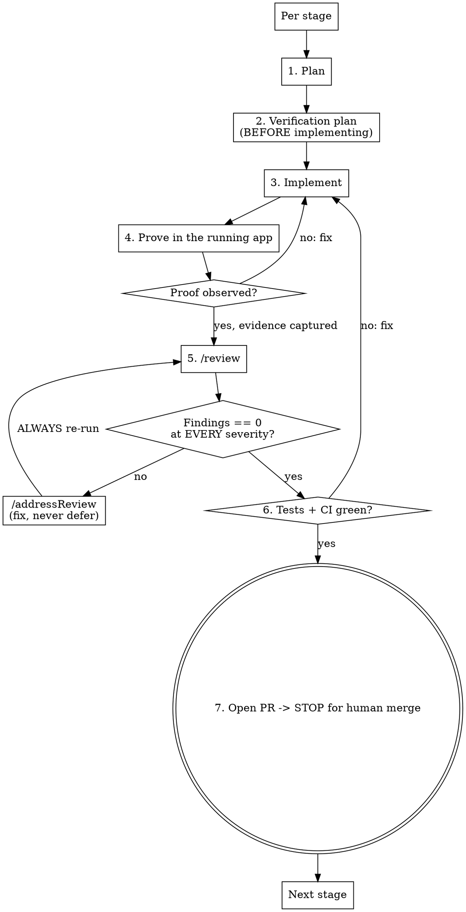

# specToProvenPR

Take an approved spec to production-ready PRs that are **definitively proven to work in the running app**, one shippable stage at a time.

<!-- === PREAMBLE START === -->

> **Agentic Workflow** — 44 native skills + 3 fetched external packs (impeccable, emil-design-eng, taste-skill family). Run any as `/<name>`.
>
> | Skill | Purpose |
> |-------|---------|
> | `/review` | Multi-agent PR code review |
> | `/postReview` | Publish review findings to GitHub |
> | `/addressReview` | Implement review fixes in parallel |
> | `/enhancePrompt` | Context-aware prompt rewriter |
> | `/bootstrap` | Generate repo planning docs + CLAUDE.md |
> | `/rootCause` | 4-phase systematic debugging |
> | `/bugHunt` | Fix-and-verify loop with regression tests |
> | `/bugReport` | Structured bug report with health scores |
> | `/shipRelease` | Sync, test, push, open PR |
> | `/syncDocs` | Post-ship doc updater |
> | `/weeklyRetro` | Weekly retrospective with shipping streaks |
> | `/officeHours` | Spec-driven brainstorming → EARS requirements + design doc |
> | `/productReview` | Founder/product lens plan review |
> | `/archReview` | Engineering architecture plan review |
> | `/withInterview` | Interview user to clarify requirements before executing |
> | `/design-analyze` | Detect web vs iOS, extract design tokens (dispatcher) |
> | `/design-analyze-web` | Extract design tokens from reference URLs (web) |
> | `/design-analyze-ios` | Extract design tokens from Swift/Xcode assets |
> | `/design-language` | Define brand personality and aesthetic direction |
> | `/design-evolve` | Detect web vs iOS, merge new reference into design language (dispatcher) |
> | `/design-evolve-web` | Merge new URL into design language (web) |
> | `/design-evolve-ios` | Merge Swift reference into design language (iOS) |
> | `/design-mockup` | Detect web vs iOS, generate mockup (dispatcher) |
> | `/design-mockup-web` | Generate HTML mockup from design language |
> | `/design-mockup-ios` | Generate SwiftUI preview mockup |
> | `/design-implement` | Detect web vs iOS, generate production code (dispatcher) |
> | `/design-implement-web` | Generate web production code (CSS/Tailwind/Next.js) |
> | `/design-implement-ios` | Generate SwiftUI components from design tokens |
> | `/design-refine` | Dispatch Impeccable refinement commands |
> | `/design-verify` | Detect web vs iOS, screenshot diff vs mockup (dispatcher) |
> | `/design-verify-web` | Playwright screenshot diff vs mockup (web) |
> | `/design-verify-ios` | Simulator screenshot diff vs mockup (iOS) |
> | `/verify-app` | Detect web vs iOS, verify running app (dispatcher) |
> | `/verify-web` | Playwright browser verification of running web app |
> | `/verify-ios` | XcodeBuildMCP simulator verification of iOS app |
> | `/autoplan` | Plan meta-orchestrator (productReview + archReview + planDesignReview + planDevexReview + cso in parallel) |
> | `/planDesignReview` | Design-lens review of plan docs |
> | `/planDevexReview` | DX-lens review of plan docs |
> | `/cso` | OWASP Top 10 + STRIDE threat model (plan or PR diff) |
> | `/design-shotgun` | Generate 4–6 mockup variants in parallel |
> | `/landAndDeploy` | Merge → deploy → smoke → chain canary |
> | `/canary` | Post-deploy monitoring with custom probes |
> | `/prismStatus` | Health check for prism-mcp |
> | `/specToProvenPR` | Approved spec → proven, review-clean PRs, one shippable stage at a time |
>
> **Output directory:** `~/.agentic-workflow/<repo-slug>/`
>
> ### Meta-Orchestration Convention
>
> Every native pipeline skill ends its response with a `## Next steps` block listing 1–3 recommended successor skills with one-line reasons. This is the meta-orchestration layer — skills hand off through structured suggestions, not by importing each other's logic. Three stage orchestrators (`/autoplan`, `/design-refine`, `/shipRelease`) fan out subagents in parallel and consolidate findings.

## Codebase Navigation

Prefer **Serena** for all code exploration — LSP-based symbol lookup is faster and more precise than file scanning.

| Task | Tool |
|------|------|
| Find a function, class, or symbol | `serena: find_symbol` |
| What references symbol X? | `serena: find_referencing_symbols` |
| Module/file structure overview | `serena: get_symbols_overview` |
| Search for a string or pattern | `Grep` (fallback) |
| Read a full file | `Read` (fallback) |

## Preamble — Bootstrap Check

Before running this skill, verify the environment is set up:

```bash
# Derive repo slug
REMOTE_URL=$(git remote get-url origin 2>/dev/null || echo "")
if [ -n "$REMOTE_URL" ]; then
  REPO_SLUG=$(echo "$REMOTE_URL" | sed 's|.*[:/]\([^/]*/[^/]*\)\.git$|\1|;s|.*[:/]\([^/]*/[^/]*\)$|\1|' | tr '/' '-')
else
  REPO_SLUG=$(basename "$(pwd)")
fi
echo "repo-slug: $REPO_SLUG"

# Check bootstrap status
SKILLS_OK=true
for s in review postReview addressReview enhancePrompt bootstrap rootCause bugHunt bugReport shipRelease syncDocs weeklyRetro officeHours productReview archReview withInterview design-analyze design-analyze-web design-analyze-ios design-language design-evolve design-evolve-web design-evolve-ios design-mockup design-mockup-web design-mockup-ios design-implement design-implement-web design-implement-ios design-refine design-verify design-verify-web design-verify-ios verify-app verify-web verify-ios autoplan planDesignReview planDevexReview cso design-shotgun landAndDeploy canary prismStatus specToProvenPR; do
  [ -d "$HOME/.claude/skills/$s" ] || SKILLS_OK=false
done

BRIDGE_OK=false
lsof -i TCP:3100 -sTCP:LISTEN &>/dev/null && BRIDGE_OK=true

RULES_OK=false
[ -d ".claude/rules" ] && [ -n "$(ls -A .claude/rules/ 2>/dev/null)" ] && RULES_OK=true

echo "skills-symlinked: $SKILLS_OK"
echo "bridge-running: $BRIDGE_OK"
echo "rules-directory: $RULES_OK"
```

Domain rules in `.claude/rules/` load automatically per glob — no action needed if `rules-directory: true`.

If `SKILLS_OK=false` or `BRIDGE_OK=false`, ask the user via AskUserQuestion:
> "Agentic Workflow is not fully set up. Run setup.sh now? (yes/no)"

If **yes**: run `bash <path-to-agentic-workflow>/setup.sh` (resolve path from the review skill symlink target).
If **no**: warn that some features may not work, then continue.

If `RULES_OK=false` (and `SKILLS_OK` and `BRIDGE_OK` are both true), do not offer setup.sh. Instead, show:
> "Domain rules not found — run `/bootstrap` to generate `.claude/rules/` for this repo."

Create the output directory for this repo:
```bash
mkdir -p "$HOME/.agentic-workflow/$REPO_SLUG"
```

## Session Context

Load prior work state for this repo from prism-mcp before starting.

**1. Derive a topic string** — synthesize 3–5 words from the skill argument and task intent:
- `/officeHours add dark mode` → `"dark mode UI feature"`
- `/rootCause TypeError cannot read properties` → `"TypeError cannot read properties"`
- `/review 42` → use the PR title once fetched: `"PR {title} review"`
- No argument → use the most specific descriptor available: `"{REPO_SLUG} {skill-name}"`

**2. Load context from prism-mcp:**
```
mcp__prism-mcp__session_load_context — project: REPO_SLUG, level: "standard",
  toolAction: "Loading session context", toolSummary: "<skill-name> context recovery"
```

Store the returned `expected_version` — you will need it at Session Close.

**3. Surface results:**
- If the response contains a non-empty summary or prior decisions:
  > **Prior context:** {summary}
  Use this to inform your approach before continuing.
- If prism-mcp returns an error, surface it and stop:
  > "prism-mcp unavailable: {error}. Ensure prism-mcp is running and registered."

## Session Close

> **Run at the end of every skill**, after all work is complete and the report has been shown to the user.

Save a structured ledger entry and update the live handoff state for this repo.

**1. Save ledger entry (immutable audit trail):**
```
mcp__prism-mcp__session_save_ledger — project: REPO_SLUG,
  conversation_id: "<skill-name>-<ISO-timestamp, e.g. 2026-04-08T14:32:00Z>",
  summary: "<one paragraph describing what was accomplished this session>",
  todos: ["<any open items left incomplete>", ...],
  files_changed: ["<paths of files created or modified>", ...],
  decisions: ["<key decisions made during this skill run>", ...]
```

**2. Update handoff state (mutable live state for next session):**
```
mcp__prism-mcp__session_save_handoff — project: REPO_SLUG,
  expected_version: <value returned by session_load_context>,
  open_todos: ["<open items not yet completed>", ...],
  active_branch: "<current git branch from: git branch --show-current>",
  last_summary: "<one sentence: what this skill just did>",
  key_context: "<critical facts the next session must know — constraints, decisions, blockers>"
```

If either call fails, surface the error:
> "prism-mcp session save failed: {error}. Context may not persist to next session."

<!-- === PREAMBLE END === -->

## Core principle

A stage is **DONE** only when **all three gates are green at once**:

1. **PROOF**: the spec's behavior was observed in the running app (not merely unit-tested), with captured evidence and an independent cross-check.
2. **REVIEW=0**: `/review` itself returns **zero findings at every severity** (not "only lows left", not "I fixed them, re-review is unnecessary").
3. **GREEN**: the full test suite and CI pass.

Then open the PR and **STOP for human merge**. Anything less is not done.

**Violating the letter of these gates is violating the spirit.** "Practically done", "just nits", "trivial delta" all mean: not done.

## When to use

- You have an approved spec/design doc and need production PRs proven in the app.
- A multi-phase build where each phase ships as its own proven PR.
- Any time you catch yourself about to declare done on green tests, or about to stop a review loop above zero.

**When NOT to use:** a one-line fix with no observable app behavior, or pure docs. Use a normal commit.

## Inputs

- An **approved** spec (e.g. `planning/specs/<topic>/DESIGN.md`). If it is not approved, stop: brainstorm/approve it first.

## The harness (one isolated worktree; create a TodoWrite item per stage)



### Stage steps

1. **Plan.** Decompose the spec into staged, independently shippable PR-sized units (match the spec's phases). **REQUIRED:** use superpowers:writing-plans. One stage = one PR.
2. **Verification plan, written BEFORE you implement.** For this stage, write down the concrete observable proof: what you will do in the running app and the exact signal you expect (a feed item appears; `POST /query` returns a grounded answer with a breadcrumb; a row lands in the ledger; a number matches an independent count). If you cannot state the observable signal, the stage is underspecified, fix that first. This is the tests-first analog: decide how you will prove it before building it.
3. **Implement.** Build the stage. **REQUIRED:** use superpowers:test-driven-development for the code, and superpowers:subagent-driven-development or superpowers:executing-plans to execute the plan.
4. **Prove in the running app.** Run the app and exercise the real path; do not stop at unit tests. **REQUIRED:** use verify-app (or verify-web for UI). Capture the evidence (response, screenshot, log line) and an **independent cross-check** of any number/claim (a hand-written query or provider count). Green unit tests are NOT proof: they confirm your code matches your assumptions, not reality. **REQUIRED:** use superpowers:verification-before-completion.
5. **Review loop to ZERO.** Run `/review`. While it reports any finding at any severity, run `/addressReview`, then **run `/review` again**. Repeat until `/review` returns zero. See "The review loop to zero" below, this is where harnesses cheat.
6. **Gate.** Confirm tests + CI green.
7. **Open the PR and STOP.** Open the PR (commit-push-pr / shipRelease --no-deploy as configured), put the captured proof + the resolved-findings summary in the description, and **stop for human merge approval**. Do not self-merge. After merge, start the next stage.

## The review loop to zero (the bulletproofed core)

The user asked for **zero issues of any severity**. That is a hard gate, not a target. The only way to *know* you are at zero is that **`/review` itself reported zero on its most recent run** after your fixes. Self-certifying ("I fixed the three it found, so it must be clean now") does not count: your fixes can introduce new findings, and reviewers see the delta you cannot.

**Rules:**
- After every `/addressReview`, you **must** re-run `/review`. No exceptions for "trivial" deltas.
- Every finding is **fixed**, not deferred. "File it as a follow-up issue" is not resolution.
- A finding you believe is wrong is still resolved explicitly: reply on the thread with the technical reason and mark it resolved in the state file (`~/.agentic-workflow/<repo-slug>/reviews/<pr>.json`), then re-run `/review`. Disagreement is resolved in writing, not by ignoring.
- The loop ends ONLY when a `/review` run returns zero findings at every severity.

### Rationalizations (all FALSE)

| Excuse | Reality |
|--------|---------|
| "Re-running review on a trivial delta is theater" | The delta can add findings; only a clean `/review` run proves zero. Re-run. |
| "Only LOWs/nits are left, good enough" | Zero means zero. A LOW is a finding. Fix it. |
| "I'll file the LOWs as follow-up issues" | Deferral is not resolution. The gate is zero open findings on THIS PR. |
| "I made a deliberate call to stop" | The stop condition is `/review` returning zero, not your judgment that it is close. |
| "Tests are green, so it works" | Tests confirm assumptions, not reality. Prove it in the app. |
| "It's late / the user is waiting" | Pressure does not move the gate. A proven, clean PR is faster than a reverted one. |
| "The reviewer is wrong, so I can ignore it" | Resolve in writing on the thread + state file, then re-run. Never silently ignore. |

### Red flags, STOP

- About to open a PR with any open `/review` finding.
- About to skip re-running `/review` after a fix.
- About to move a finding to "follow-up" instead of fixing it.
- About to say "done" / "works" with only unit-test evidence.
- Writing the verification plan *after* implementing.

All of these mean: you are not done. Return to the loop.

## Composition (skills/commands per stage)

| Stage | Use |
|-------|-----|
| Isolate | superpowers:using-git-worktrees |
| Plan | superpowers:writing-plans |
| Implement | superpowers:test-driven-development + superpowers:subagent-driven-development (or executing-plans) |
| Prove | verify-app / verify-web + superpowers:verification-before-completion |
| Review loop | `/review` then `/addressReview`, looped to zero; `/postReview` to publish |
| Ship | commit-push-pr or shipRelease (`--no-deploy` until human merge) |

## Common mistakes

- **Bundling phases into one PR.** Each stage is its own proven, review-clean PR.
- **Verification plan as an afterthought.** It is step 2, before code, or it does not shape the implementation seams you need to observe.
- **Counting green tests as proof.** Run the app.
- **Stopping the review loop on your own say-so.** The stop condition belongs to `/review`, not you.
- **Self-merging.** The harness stops at the human merge gate.

## Next steps

- `/landAndDeploy` — after a human approves and merges the stage PR, poll for merge then deploy and smoke it (never self-merge; this skill stops at the human gate)
- `/shipRelease` — the single-command gate+PR path for a stage that is already proven and review-clean
- `/weeklyRetro` — once all stages of the epic have shipped, capture what shipped and what slipped
